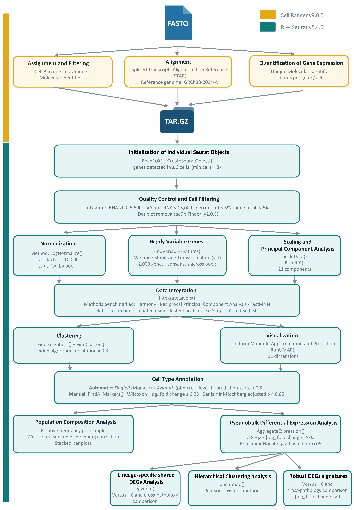

# Single-cell transcriptomic profiling of peripheral immune cells in genetically stratified Parkinson’s disease and progressive supranuclear palsy
This repository provides a standardized, end-to-end bioinformatic pipeline for the end-to-end analysis of single-cell RNA sequencing (scRNA-seq) data from Peripheral Blood Mononuclear Cells (PBMCs).

The scripts were developed for the identification of immune cell-type-specific transcriptomic signatures across diagnostic groups, including sporadic PD (sPD), Genetic PD (gPD; carrying GBA and LRRK2 variants), PSP and healthy controls (HC). 

First, samples were processed using **Cell Ranger v9.0.0** (10x Genomics) prior to running these scripts. Cell Ranger performed read alignment to the **GRCh38-2024-A** reference genome using STAR, barcode filtering, UMI counting, and generation of filtered count matrices. Output is provided as compressed archives (tar.gz) containing the three standard sparse matrix components:

- barcodes.tsv.gz: cell barcode identifiers.
- features.tsv.gz: gene identifiers (gene name + Ensembl ID).
- matrix.mtx.gz: unique molecular identifier (UMI) count matrix in sparse format.

For each sample, these files are read into R using `Read10X()` from Seurat.

R Analysis is organized into three stages to ensure reproducibility:

1. Preprocessing, Quality Control and Integration: rigorous quality filtering ($nFeature$, $nCount$, mitochondrial/hemoglobin pertentage content) and doublet removal. Then, to remove technical bath effect due to the processing pools, RPCA method was used after comparing the 3 different methods (harmony, RPCA and FastMMN) using LISI package.
2. Cell Type Annotation: Automatic cell-type annotation via SingleR and Azimuth, validated by canonical marker gene expression through `FindAllMarkers()` seurat's function.
3. Downstream Analysis: Pseudobulk differential expression analysis using DESeq2 to identify disease-specific signatures, lineage-based Venn diagram generation, and hierarchical clustering based on differential expressed genes for each lineage of individual samples.

Within each script there is information about the functions of each section, as well as the parameters and filters applied. For a better understanding of the steps and tools used, refer to the [[Workflow](Workflow.jpg)]

## Author
[@mariaguillen09](https://www.github.com/mariaguillen09)


## `R` Analysis Scripts

### Part 1 — Preprocessing, Quality Control and Batch Integration

**Script:** `scripts/Part_1_Preprocessing_QC_Integration.Rmd`

This script loads the count matrices obtained from `Cell Ranger` and performs all preprocessing steps prior to cell type annotation.

- **Data loading:** Individual Seurat objects are created per sample with associated metadata (diagnosis, pool, sample ID) with Read10X and CreateSeuratObject functions from Seurat package.
- **Quality control:** QC metrics are calculated per cell (`nFeature_RNA`, `nCount_RNA`, `percent.mt`, `percent.hb`) and filters are applied:
  - 200 < nFeature_RNA < 5,500
  - nCount_RNA < 15,000
  - percent.mt < 5% and percent.hb < 5%
- **Doublet detection:** Doublets are identified and removed using `scDblFinder`
- **Normalization and High Variable Genes (HVGs) selection:** LogNormalize (scale factor 10,000) and selection of 2,000 highly variable genes using `vst`, applied per pool layer.
- **Dimensionality reduction:** Scaling and PCA (21 principal components)
- **Batch correction:** Three integration methods are evaluated (Harmony, RPCA and FastMNN) and their quality is assessed using the **LISI** index (pool LISI and cluster LISI). **RPCA** is selected as the final integration method.
- **Clustering:** Leiden algorithm (resolution 0.3) via `FindClusters` function.

**Output:** `Results/Integrated_Seurat_Object.rds`

### Part 2 — Cell Type Annotation

**Script:** `scripts/Part_2_Cell_Type_Annotation.Rmd`

This script annotates the cell clusters identified in Part 1 using a combination of automatic and manual strategies.

- **Automatic annotation:**
  - `SingleR` using the Monaco Immune Data reference
  - `Azimuth` using the PBMC multimodal reference (`pbmcref`); cells with prediction confidence score < 0.5 are removed
- **Marker gene identification:** `FindAllMarkers` (Wilcoxon, min.pct = 0.25, logfc.threshold = 0.25, BH-adjusted p < 0.05)
- **Manual validation:** Canonical marker genes validated via DotPlot against established PBMC markers (Zheng et al. 2017; Monaco et al. 2019)
- **Final annotation:** 11 immune populations identified:
  - T CD4 cells, T CD8 cells, NK cells, B cells
  - Monocytes, Dendritic cells
  - HSC, Proliferative cells, Platelets, Neutrophils, Basophils
- **Diagnostic grouping:** PD_GBA and PD_LRRK2 samples are merged into a unified **Monogenic-PD** group for downstream comparisons

**Output:** `Results/Final_Annotated_Seurat_Object.rds`


### Part 3 — Downstream Analysis

**Script:** `scripts/Part_3_Downstream_Analysis.Rmd`

This script performs all downstream analyses on the annotated object, including differential expression, visualization and inflammatory scoring.

- **Relative abundance analysis:** Cell type proportions per sample and diagnostic group; pairwise Wilcoxon tests with BH correction
- **Pseudobulk DEG analysis:** 
  - Counts aggregated by cell type × diagnosis × sample using `AggregateExpression`
  - All pairwise comparisons between diagnostic groups tested with DESeq2 via `FindMarkers`
  - Minimum 3 replicates per group required; significance threshold: padj < 0.05
- **Venn diagrams:** Shared and exclusive DEGs across comparisons, stratified by myeloid and lymphoid lineages (`ggvenn`)
- **Sample-level heatmaps:** Z-score expression of lineage DEGs across 16 individual samples:
  - Pseudobulk per sample, LogNormalize, Z-score per gene
  - Hierarchical clustering: ward.D2, correlation distance (`pheatmap`)

**Output:** `Results/Final_Analyzed_Seurat_Object.rds`, `Results/DEGs_pseudobulk.xlsx`


## 3. Data exploration and visualization

| Figure | Script | Description |
|---|---|---|
| Pre/Post-QC violin plots | Part 1 | QC metric distributions before and after filtering |
| Elbow plot | Part 1 | Variance explained by PCA components |
| UMAP pre-integration | Part 1 | Batch effect visualization by pool |
| Integration UMAPs | Part 1 | Harmony, RPCA and FastMNN comparison |
| SingleR / Azimuth UMAPs | Part 2 | Automatic annotation results |
| DotPlot canonical markers | Part 2 | Manual annotation validation |
| Combined annotation UMAP | Part 2 | Clusters, cell types and diagnosis |
| Relative abundance barplot | Part 3 | Cell type proportions by diagnosis |
| Venn diagrams | Part 3 | Shared/exclusive DEGs by lineage |
| Sample-level heatmaps | Part 3 | Z-score DEG expression across 16 samples |


## 4. Workflow

<p align="center">
  
</p>


## 5. Dependencies

### R version
```
R >= 4.5.2
```

### Packages

| Category | Packages |
|---|---|
| Single-cell analysis | `Seurat >= 5.5.0`, `SeuratWrappers`, `scDblFinder >= 2.0.3` |
| Batch correction | `batchelor` (FastMNN) |
| Annotation | `SingleR`, `celldex`, `Azimuth` |
| Differential expression | `DESeq2` |
| Visualization | `ggplot2`, `pheatmap`, `ggvenn`, `patchwork`, `ggpubr` |
| Utilities | `tidyverse`, `openxlsx`, `lisi`, `future` |

### Installation

```r
# CRAN
install.packages(c("Seurat", "ggplot2", "tidyverse", "openxlsx",
                   "patchwork", "ggvenn", "ggpubr", "pheatmap"))

# Bioconductor
BiocManager::install(c("scDblFinder", "SingleR", "celldex",
                       "DESeq2", "batchelor"))

# GitHub
remotes::install_github("satijalab/seurat-wrappers")
remotes::install_github("satijalab/azimuth")
remotes::install_github("immunogenomics/lisi")
```
